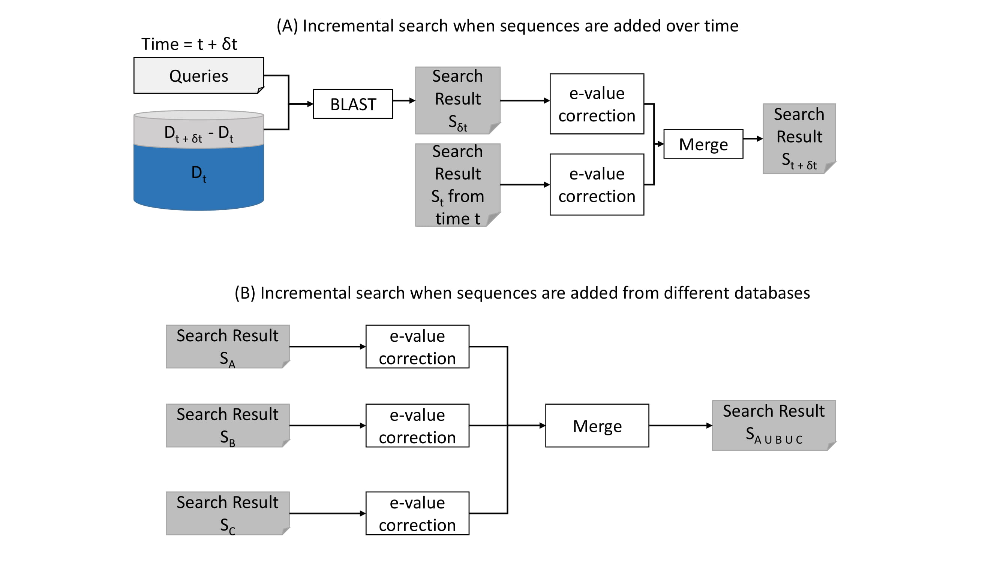
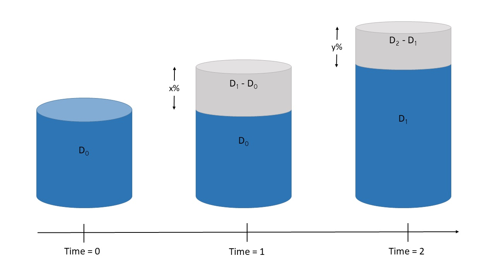
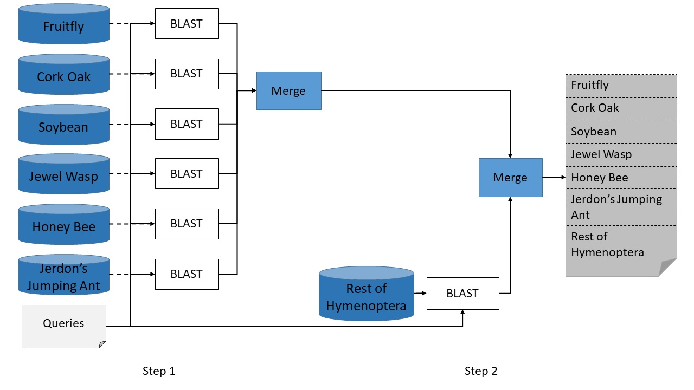
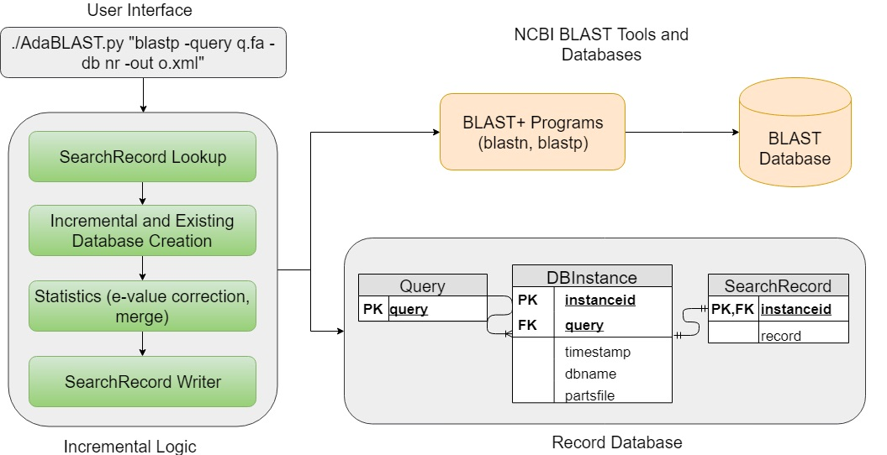

# iBLAST
We develop an efficient way to redeem spent BLAST search effort by introducing the iBLAST. The tool makes use of the previous BLAST search results as it conducts new searches on only the incremental part of the database, recomputes statistical metrics such as e-values and combines these two sets of results to produce updated results. We develop statistics for correcting e-values of any BLAST result against any arbitrary sequence database. The experimental results and accuracy analysis demonstrate that Incremental BLAST can provide search results identical to NCBI BLAST at a significantly reduced computational cost

## Requirement for iBlast**

1. Python3
2. BLAST+ command line tools (You can install the command line tools from the source provided with this distribution)  
`./NCBI-BLAST-installer.sh`  
3. Add BLAST+ executables to PATH (../ncbi-blast/ncbi-blast-2.8.1+-src-iBLAST/c++/ReleaseMT/bin)  
 `export PATH=../ncbi-blast/ncbi-blast-2.8.1+-src-iBLAST/c++/ReleaseMT/bin:$PATH`

---

## Install iBLAST

`./iBLAST-installer.sh`


## Running iBLAST
Running iBLAST is pretty similar to regular BLAST commands. You just need to pass the regular BLAST command to a python script (iBLAST.py).

`python3 iBLAST.py "blastp -db nr -query query.fasta -outfmt 5 -out result.xml"`


## A Typical Usecase of iBLAST
Usually when a researcher is conducting research involving protein and dna sequences, she will perform BLAST 
search using the sequences of her interest against a curated database. In the most simple case, if she is 
working with protein sequences, she will search in a protein database; if she is working with DNA sequences, 
she will search in a DNA database.

Since the database is growing through different stages of her research, these search results need to be updated.
Assume, she performs BLAST search at 3 different times.

1. At time 0: we will call the database D0
2. At time 1: we will call the database D1. Between time 0 and 1, the database increased by x%
3. At time 2: we will call the database D2. Between time 1 and 2, the database increased by y%


Note, |D0| < |D1| < |D2|.


At time 0, she will perform BLAST search using following iBLAST command:
```
python3 iBLAST.py "blastp -db nr -query query.fasta -outfmt 5 -out result.xml"  
python3 iBLAST.py "blastn -db nt -query query.fasta -outfmt 5 -out result.xml"
```

At time 1, the database has increased in size by x%. But the user does not need to check for that or take any additional
steps to make sure that an incremental search is performed instead of a search from scratch. She will issue the
same iBLAST commands as before.

```
python3 iBLAST.py "blastp -db nr -query query.fasta -outfmt 5 -out result.xml"  
python3 iBLAST.py "blastn -db nt -query query.fasta -outfmt 5 -out result.xml"
```

At time 2, the database has increased by additional y%. Like time 1, the user does not need to check for that or take any additional
steps to make sure that an incremental search is performed instead of a search from scratch. She will issue the
same iBLAST commands as before.

```
python3 iBLAST.py "blastp -db nr -query query.fasta -outfmt 5 -out result.xml"  
python3 iBLAST.py "blastn -db nt -query query.fasta -outfmt 5 -out result.xml"
```

Note, the user is performing the same command everytime. So, she does not have to remember or maintain the past search results, thus there is not added cognitive overhead.

## A more complex usecase: incorporating taxon-specific domain knowledge
Say you have just sequenced an entire proteome of a new organism. You have some domain knowledge and intuition about its closer relatives in the evolutionary tree and some other sources where it 
might have picked up some of its proteins. For example, we have sequenced Gall Wasp, which is an insect, so probably searching against the sequences from insect specific taxon would give us
most of the homologs. But, there is another interesting observation about Gall Wasp, it spent a long time on Cork Oak tree throughout its evolutionary history and we suspect some beneficial 
genes/proteins from oak tree might have jumped to Gall Wasp's genome/proteome. So, instead of performing the search against entire nr, we perform several searches against some of the taxa specific databases,
and combine the result to see if we have gathered enough homologs compared to the result obtained by searching against the entire nr. So, here we correct evalues for each of these search results and then merge them
together.




## How does iBLAST work in the background?



## Additional Utilities
While AdaBLAST is a complete end-to-end software that provides a BLAST-like interface and takes care of all 
the book-keeping
### Merging two results
```
 python BlastpMergerModule.py input1.xml input2.xml output.xml 
 python BlastnMergerModule.py input1.xml input2.xml output.xml 
```
### Merging N results
` python BlastpMergerModuleX.py 3 input1.xml input2.xml input3.xml output.xml`

## View Examples using Python Notebook Viewer  
Change from default viewer to **IPython Notebook**  
1. [Example of iBLAST for blastn (Karlin-Altschul Statistics)](https://bitbucket.org/sajal000/incremental-blast/src/master/examples/iBLAST%20Demonstration%20for%20blastn%20(Karlin-Altschul%20Statistics).ipynb?viewer=nbviewer)  
2. [Example of iBLAST for blastp (Spouge Statistics)](https://bitbucket.org/sajal000/incremental-blast/src/master/examples/iBLAST%20Demonstration%20for%20blastp%20(Spouge%20Statistics).ipynb)
